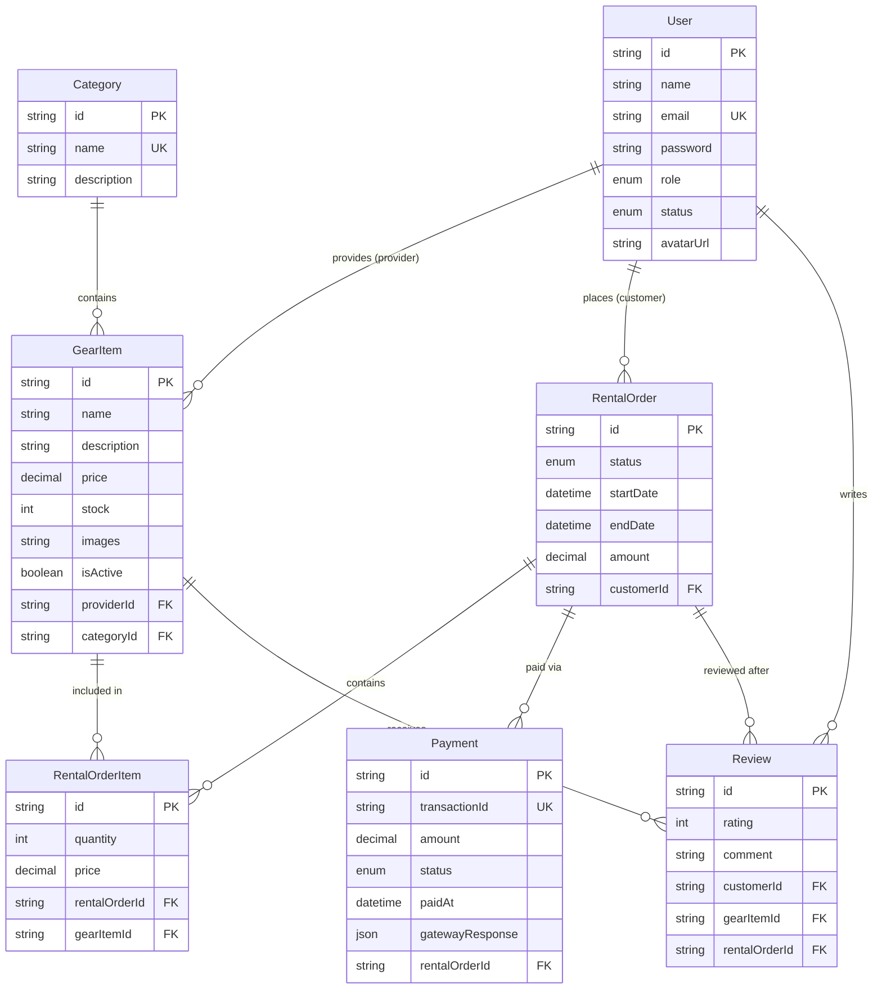

# GearUp Frontend🏋️ 
**"Sports & Outdoor Gear Rental Platform - Rent Sports & Outdoor Gear Instantly"**

---

## Project Overview

GearUp is a modern, responsive **Next.js application** for a sports and outdoor equipment rental service. Customers can browse available gear, select rental dates, and complete secure payments. Providers manage their gear inventory and fulfill rental orders through an intuitive dashboard. Admins oversee the entire platform through a comprehensive moderation interface. 

**Live Demo:** [https://gearup-frontend-nu.vercel.app](https://gearup-frontend-nu.vercel.app)  
**Backend API:** [https://gear-up-iota.vercel.app](https://gear-up-iota.vercel.app)  
**API Integration Docs:** [API_INTEGRATION.md](./API_INTEGRATION.md)

---

## Roles & Permissions

| Role | Description | Frontend UI Expectations |
|------|-------------|-----------------|
| **Customer** | Users who rent sports gear | Public browsing, interactive date-pickers for rentals, checkout/payment flow, order tracking dashboard, review submission. |
| **Provider** | Gear vendors/rental shops | Protected provider dashboard, gear CRUD forms (with image upload UI), order management tables with status-update actions. |
| **Admin** | Platform moderators | Protected admin dashboard, user management tables (suspend/activate actions), global platform statistics, content moderation UI. |

> 💡 **Note**: Users select their role during registration. The UI dynamically adapt based on the authenticated user's role, and routes is protected using **Next.js Middleware**.

---

## 🚀 Features & UI/UX Requirements

### Public Features
- **Responsive Gear Grid**: Display equipment with optimized images (`next/image`), price per day, category, and availability status.
- **Advanced Search & Filter**: Sidebar or top-bar filters for category, price range, brand, and availability dates with real-time UI updates.
- **Gear Details Page**: Comprehensive view with image gallery, specifications, provider info, and an interactive "Rent Now" section (with date pickers).
- **Loading & Error States**: Skeleton loaders for data fetching and graceful `error.tsx` fallbacks.

### Customer Features
- **Auth Flows**: Registration and login forms with Zod validation and inline error messages.
- **Rental Order Flow**: Interactive checkout UI to select rental dates and confirm items. 
- **Payment Integration**: Seamless redirect to **Stripe Checkout** or **SSLCommerz** gateway. Dedicated `/payment/success` and `/payment/cancel` pages with clear UI feedback.
- **Customer Dashboard**: View rental order history (with status badges), payment history table, and a form to leave reviews after the gear is returned.

### Provider Features
- **Provider Dashboard**: Overview of total gear listed, active rentals, and pending orders.
- **Inventory Management**: Forms to add, edit, and remove gear. Include UI for image URL uploads, pricing, and stock/availability toggles.
- **Order Management**: A dedicated table to view incoming orders with action buttons to update status (e.g., "Confirm", "Mark Picked Up", "Mark Returned").

### Admin Features
- **Admin Dashboard**: Global overview of platform health (total users, active gear, total rentals).
- **User Management**: Data table of all users with search, pagination, and "Suspend/Activate" action buttons.
- **Content Moderation**: Views to inspect all gear listings and rental orders across the platform.

---

## Frontend Routes & API Integration

> ⚠️ **Note**: These are suggested Next.js App Router paths. You must map these to your backend API endpoints.

| Next.js Route | Component/Feature | Backend API Consumption |
|---------------|-------------------|-------------------------|
| `/` | Home page with featured gear | `GET /api/gear` |
| `/gear` | Browse & filter gear | `GET /api/gear`, `GET /api/categories` |
| `/gear/[id]` | Gear details & rent CTA | `GET /api/gear/:id` |
| `/auth/register` | Role selection & registration form | `POST /api/auth/register` |
| `/auth/login` | Login form | `POST /api/auth/login` |
| `/dashboard/customer` | Customer overview & order history | `GET /api/rentals`, `GET /api/payments` |
| `/dashboard/customer/orders/[id]/pay` | Payment initiation page | `POST /api/payments/create` |
| `/payment/success` & `/payment/cancel` | Payment outcome pages | (Updates UI based on URL params/session) |
| `/dashboard/provider` | Provider overview & inventory list | `GET /api/provider/gear` |
| `/dashboard/provider/gear/new` | Add gear form | `POST /api/provider/gear` |
| `/dashboard/provider/orders` | Manage incoming orders | `GET /api/provider/orders`, `PATCH /api/provider/orders/:id` |
| `/dashboard/admin` | Admin overview & user management | `GET /api/admin/users`, `PATCH /api/admin/users/:id` |

---

## Flow Diagrams & UI Considerations

### 🏋️ Customer Journey
```text
[Register/Login] → [Browse Gear] → [View Details] 
       ↓
[Select Dates & "Rent Now"] → [Checkout UI]
       ↓
[Stripe/SSLCommerz Redirect] → [Payment Success Page]
       ↓
[Track Order Status] → [Mark as Returned] → [Leave Review Form]
```
> **UI Focus**: Date pickers prevent selecting past dates or overlapping unavailable dates. Use toast notifications for order placement success/failure.

### 🏪 Provider Journey
```text
[Register/Login] → [Dashboard Overview] → [Add Gear Form]
       ↓
[View Incoming Orders Table] → [Click "Confirm" / "Mark Picked Up"]
       ↓
[Toast Notification: "Order Updated"] → [Customer can now pick up]
```
> **UI Focus**: Use optimistic UI updates or React Query invalidation to instantly reflect status changes in the order table without a full page reload.

---

## 🛠️ Tech Stack

| Technology | Version | Purpose |
|------------|---------|---------|
| **Next.js** | 16.x | App Router, Server/Client Components, Middleware, API Routes |
| **TypeScript** | 5.x | Full type safety across components, hooks, and API layer |
| **Tailwind CSS** | 4.x | Utility-first styling (no config file — uses `@import "tailwindcss"`) |
| **TanStack Query** | 5.x | Server state, caching, optimistic updates, background refetch |
| **Zustand** | 5.x | Client-side auth state with localStorage + cookie persistence |
| **React Hook Form** | 7.x | Form state management |
| **Zod** | 3.x | Schema validation on all forms |
| **Axios** | 1.x | HTTP client with request/response interceptors |
| **Sonner** | 1.x | Toast notifications |
| **date-fns** | 4.x | Date calculations for rental duration |
| **next-themes** | 0.4.x | Theme provider |
| **Vercel** | — | Deployment |

---

---

## 🗄️ Database Schema

**6 models with full relational design:**


| Model | Key Fields |
|-------|-----------|
| `User` | id, name, email, password, role (CUSTOMER/PROVIDER/ADMIN), isActive |
| `GearItem` | id, name, price, stock, isAvailable, providerId, categoryId |
| `Category` | id, name, description |
| `RentalOrder` | id, startDate, endDate, totalAmount, status, customerId, gearId |
| `Payment` | id, transactionId, amount, method, status, paidAt, gatewayResponse |
| `Review` | id, rating, comment, userId, gearId |

**Rental Status Flow:** `PLACED → CONFIRMED → PAID → PICKED_UP → RETURNED / CANCELLED`

**Payment Status:** `PENDING → COMPLETED / FAILED`

---

---

## Entity Relationship Diagram



## 🏗️ Project Structure

```
src/
├── api/                  # API service layer
│   ├── axios.ts          # Configured Axios instance with interceptors
│   ├── authApi.ts        # Auth endpoints
│   ├── gearApi.ts        # Gear + categories
│   ├── rentalApi.ts      # Rental orders
│   ├── paymentApi.ts     # Payment initiation + history
│   ├── providerApi.ts    # Provider gear CRUD + orders
│   ├── adminApi.ts       # Admin management
│   └── reviewApi.ts      # Reviews
├── app/
│   ├── api/auth/set-token/ # Internal route — sets secure cookie server-side
│   ├── auth/             # Login + Register pages
│   ├── dashboard/
│   │   ├── admin/        # Admin dashboard, users, gear, rentals
│   │   ├── customer/     # Customer dashboard, orders, payments, settings
│   │   └── provider/     # Provider dashboard, inventory, orders, settings
│   ├── gear/             # Browse, details, checkout
│   └── payment/          # Success + cancel pages
├── components/
│   ├── auth/             # LoginForm, RegisterForm, ProtectedRoute
│   ├── gear/             # GearCard, GearGrid, FilterSidebar
│   ├── home/             # HeroSection, FeaturedGear, HowItWorks, etc.
│   ├── layout/           # Navbar, Footer, NetworkStatus
│   ├── provider/         # GearForm (create/edit)
│   ├── review/           # ReviewDialog with star picker
│   └── ui/               # Button, Input, Card, Badge, Table, Skeleton, Dialog, Toast, etc.
├── hooks/                # TanStack Query custom hooks
├── lib/
│   ├── auth-storage.ts   # localStorage + cookie token management
│   ├── utils.ts          # cn(), formatDate(), formatBDT(), buildQueryParams()
│   └── validation.ts     # All Zod schemas
├── middleware.ts          # Route protection (token existence check)
├── providers/            # QueryProvider, AuthProvider
├── store/                # Zustand authStore with individual stable selectors
└── types/                # TypeScript interfaces matching Prisma schema
```

---

## 📋 Mandatory Requirements Checklist

| # | Requirement | Status |
|---|-------------|:------:|
| 1 | API Integration — all endpoints consumed + `API_INTEGRATION.md` | ✅ |
| 2 | Consistent UI Error Handling — toasts, inline errors, `error.tsx`, 404 | ✅ |
| 3 | 20+ meaningful frontend commits | ✅ |
| 4 | Zod + React Hook Form validation on all forms | ✅ |
| 5 | Admin credentials working on deployed site | ✅ |
| 6 | SSLCommerz payment flow — initiate → redirect → success/cancel pages | ✅ |

---

## ⚙️ Getting Started

### Prerequisites

- Node.js 18+
- npm

### Installation

```bash
# Clone the repo
git clone <repo-url>
cd GearUp-Frontend

# Install dependencies
npm install

# Create environment file
cp .env.example .env.local
```

### Environment Variables

```env
NEXT_PUBLIC_API_URL=https://gear-up-iota.vercel.app
NEXT_PUBLIC_APP_URL=http://localhost:3000
```

### Run Development Server

```bash
npm run dev
```

Open [http://localhost:3000](http://localhost:3000).

### Build for Production

```bash
npm run build
npm run start
```

---

## 🔐 Authentication

- JWT token stored in **localStorage** (for Axios requests) and a **secure cookie** (for Next.js Middleware)
- After login/register, `POST /api/auth/set-token` sets the cookie server-side with `Secure: true` so the middleware can read it immediately on the next navigation request
- On 401 response, Axios interceptor clears auth and redirects to `/auth/login?redirect=<path>`
- Middleware protects all `/dashboard/*` routes — role-based access handled client-side by layout components

---

## 💳 Payment Integration (SSLCommerz)

1. Customer clicks **"Proceed to Pay"** → `POST /api/payments/create`
2. Backend creates a PENDING payment record and returns `gatewayPageURL` from SSLCommerz
3. Browser redirects to SSLCommerz sandbox gateway
4. Customer completes payment (bKash, card, etc.)
5. SSLCommerz POSTs to backend `/api/payments/confirm`
6. Backend validates, marks payment COMPLETED, order PAID
7. Backend redirects to `/payment/success?order_id=...&tran_id=...` on the frontend

---

## 🧪 Test Credentials

| Role | Email | Password |
|------|-------|----------|
| **Admin** | `admin@gearup.com` | `admin123` |
| **Provider** | `rahman@gearup.com` | `provider123` |
| **Provider** | `hossain@gearup.com` | `provider123` |
| **Customer** | `akter@gearup.com` | `customer123` |

---

## 🗺️ Route Overview

| Route | Access | Description |
|-------|--------|-------------|
| `/` | Public | Landing page with featured gear |
| `/gear` | Public | Browse & filter all gear |
| `/gear/[id]` | Public | Gear details + reviews |
| `/gear/[id]/checkout` | Customer | Confirm rental dates |
| `/auth/login` | Public | Login form |
| `/auth/register` | Public | Register with role selection |
| `/dashboard/customer` | Customer | Overview stats + recent orders |
| `/dashboard/customer/orders` | Customer | Order list with status tabs |
| `/dashboard/customer/orders/[id]` | Customer | Order details + status timeline |
| `/dashboard/customer/orders/[id]/pay` | Customer | Payment initiation |
| `/dashboard/customer/payments` | Customer | Payment history + receipts |
| `/dashboard/customer/settings` | Customer | Profile + change password |
| `/dashboard/provider` | Provider | Stats + recent orders |
| `/dashboard/provider/gear` | Provider | Inventory management |
| `/dashboard/provider/gear/new` | Provider | Add gear form |
| `/dashboard/provider/gear/[id]/edit` | Provider | Edit gear form |
| `/dashboard/provider/orders` | Provider | Incoming orders + status actions |
| `/dashboard/admin` | Admin | Platform overview |
| `/dashboard/admin/users` | Admin | Suspend/activate users |
| `/dashboard/admin/gear` | Admin | All gear listings |
| `/dashboard/admin/rentals` | Admin | All rental orders |
| `/payment/success` | Public | Payment success result |
| `/payment/cancel` | Public | Payment cancel result |

---

## 📝 Scripts

```bash
npm run dev          # Start development server
npm run build        # Production build
npm run start        # Start production server
npm run lint         # Run ESLint
npm run format       # Prettier format
npm run format:check # Prettier check
```

---

## 🚢 Deployment

Deployed on **Vercel** using the Vercel CLI (no GitHub integration required):

```bash
# Install Vercel CLI
npm i -g vercel

# Login
vercel login

# Deploy to production
vercel --prod --yes
```

Environment variables are set in Vercel project settings:
- `NEXT_PUBLIC_API_URL`
- `NEXT_PUBLIC_APP_URL`
